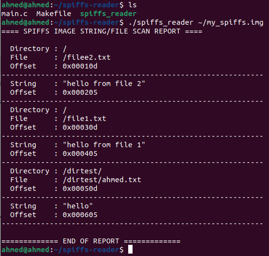

# SPIFFS: Study and Forensic Analysis

## Usage Context

**SPIFFS (SPI Flash File System)** is a lightweight filesystem designed for embedded systems using NOR flash memory. It is widely used in microcontroller-based platforms such as the **ESP8266** and **ESP32**, where system resources (RAM, CPU, and storage) are extremely limited. Its minimal footprint and ease of integration make it ideal for **IoT devices**, **sensors**, and other low-power, low-resource embedded devices. Unlike traditional filesystems like FAT, SPIFFS does not support directories or timestamps; instead, files are referenced directly by their path-like names.

## Main Characteristics

- Designed for **NOR flash memory**
- **No directory hierarchy** — flat namespace using full file paths
- Supports **wear-leveling** and **power-loss resilience**
- Minimal **RAM usage** during runtime
- Files can be **overwritten in-place**, but block erasure happens in bulk

SPIFFS uses a **log-structured design**, which appends changes instead of modifying data in-place. This helps reduce flash wear and supports recovery after sudden power loss.

## File Deletion Behavior

When a file is deleted in SPIFFS, the system marks the corresponding **object headers** and **index pages** as deleted. However, the actual data remains in the memory until the corresponding flash pages are reclaimed and reused. These blocks are not immediately erased due to the constraints of NOR flash memory (which requires whole-block erasure). As a result, deleted file data can often be found and analyzed in the raw filesystem image before it gets overwritten — providing an opportunity for **forensic recovery**.

# SPIFFS Forensic Reader

A simple forensic tool that reads a SPIFFS (SPI Flash File System) image and displays:

- **Directories** inferred from file paths  
- **Files** and their offsets  
- **Printable content** found in each file  
- **Generic strings** and log fragments  
- _Work in progress:_ detection and recovery of deleted file remnants  

## Quick Start

1. **Build the tool**  
   ```bash
   make
 **run the scanner**  
./spiffs_reader my_spiffs.img

2. **results**
 

## Challenges and Future Improvements

### Difficulties Encountered

1. **Simulating Deleted Files**  
   - PlatformIO’s `buildfs` command always creates a fresh image based on the current `data/` folder.  
   - Deleted files simply do not appear in new images, making it impossible to test deletion recovery without dumping a live flash or manually editing the binary.

2. **Identical `object_id` Values**  
   - In simple test images, multiple files share the same SPIFFS `object_id`, preventing reliable association of data pages to individual files.  
   - This leads to mixed or duplicated content when reconstructing file bodies.

3. **Lack of Native Directory Structure**  
   - SPIFFS does not maintain real directories—paths are part of file names only.  
   - Inferring folder hierarchies requires string parsing rather than reading a dedicated index.

4. **Heuristic String Carving**  
   - Relying on printable‐string scanning can pick up log fragments, metadata, or false positives.  
   - Balancing noise vs. comprehensiveness (minimum string length) required trial and error.

---

### Possible Improvements

1. **Full SPIFFS Metadata Parsing**  
   - Implement or integrate a parser for SPIFFS object lookup tables, erase blocks, and page spans.  
   - This would allow accurate recovery of file content even when `object_id`s collide.

2. **Automated Deleted-File Simulation**  
   - Develop a small ESP32/ESP8266 Arduino sketch that writes files, deletes one, then dumps the flash over serial.  
   - This produces realistic test images without manual hex edits.

4. **Export Formats**  
   - Add CSV or JSON output modes to facilitate integration with other tools or reporting pipelines.  
   - Optionally generate a visual HTML report with clickable file entries.

5. **Directory Tree Reconstruction**  
   - Group detected file paths into a tree structure in memory, then print a hierarchical view (like `tree`).  
   - This would help users understand folder layouts at a glance.

6. **Error Handling and Logging**  
   - Improve resilience against malformed or truncated images by adding sanity checks and verbose logging.  
   - Provide clear messages when recovery of deleted files is not possible.


